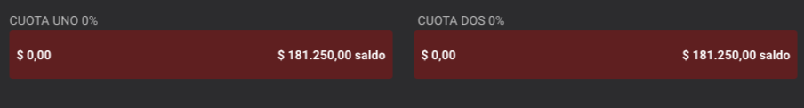
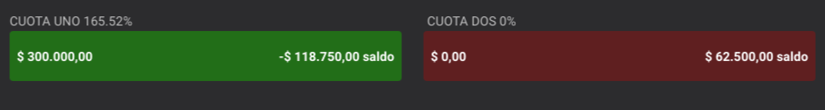
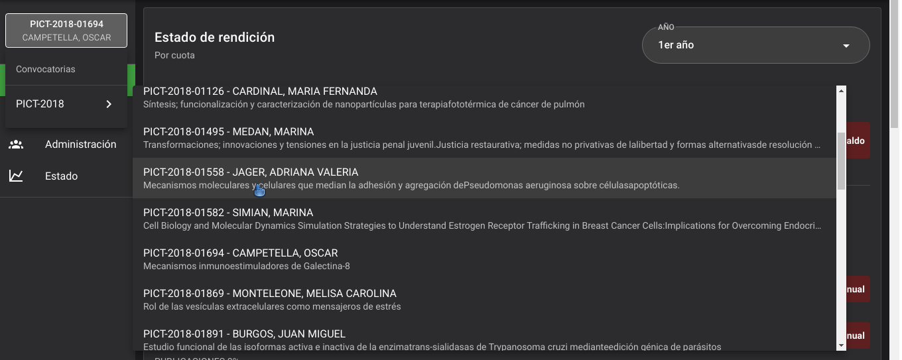
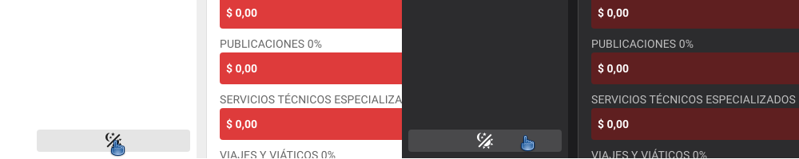

# CUESTOR

Contenido
[[toc]]

## **¿Qué es CUESTOR?**

CUESTOR es un sistema que calcula de manera automática el saldo de los PICT en base a las rendiciones que son cargadas en el mismo. Ideado para agilizar la comunicación entre los administradores y los responsables del proyecto.

### Características Principales

- Permite el acceso remoto desde internet y guarda una copia local de la información por lo cual tanto  el administrativo como el investigador pueden operar desde cualquier computadora que posea un navegador web.
- Centraliza la información pertinente a la convocatoria y sus proyectos en un servidor central, evitando errores y duplicación de trabajo.
- Permite conocer el estado de las rendiciones individuales de cada proyecto y el estado global de cada convocatoria, por lo cual permite tener una visión más amplia de todo el proceso administrativo.
- Posee un Historial de datos, y permite acceder a un registro de cambios por lo que facilita la extracción de datos para consulta.

### Tipos de usuario

- Regente: Tiene acceso a todas las secciones, tiene permisos para realizar cualquier modificación.
- Administrador: Tiene acceso a todas las secciones, tiene permisos para realizar cambios a excepción de crear o borrar proyectos.
- Supervisor: Tiene acceso a todas las secciones. No puede realizar cambios.
- Usuario de consulta: Tiene acceso solo a las secciones Resumen y Rendiciones. No puede realizar cambios. Solo puede ver los proyectos en los que figure como responsable.

## Secciones

### Resumen

Muestra el estado del PICT Activo. Todos los usuarios pueden acceder a esta sección, los usuarios de consulta sólo podrán visualizar los proyectos de los que sean responsables.

- Estado de rendición: muestra el estado de la rendición en el proyecto activo.

- Rendición por rubros: Estado de rendición por rubro según presupuesto anual.

- Datos del proyecto: componente que detalla todos los datos que no estén relacionados con aspectos monetarios del proyecto. También ofrece la posibilidad de descargar en pdf una copia original del documento del proyecto.

- Presupuesto: Detalle sobre el presupuesto anual por rubro asignado al proyecto.

- Informes: Estado de los informes cientifico tecnologicos.

- Comentarios: En este componente el administrador puede dejar un mensaje al responsable del proyecto.

### Rendiciones

En esta sección se pueden visualizar y cargar nuevas rendiciones al proyecto activo

- Pueden acceder tanto los usuarios de consulta como los administradores estos últimos son los únicos capaces de hacer modificaciones

#### Cada rendición posee los siguientes campos

- Fecha: fecha en la que se creó la rendición
- Año: El año al que se va a asignar la rendición. Un proyecto puede tener 1 ó más años
- Cuota: Cuota a la que se le asigna la rendición. Solo hay dos cuotas por año
- Monto: Monto de la rendición en Pesos
- Cuenta: Número de cuenta
- Concepto: Descripción de la rendición
- Proveedor: Datos del proveedor
- Numero de factura: Numero de factura del comprobante
- Comentario: Información adicional

### Administración

Sección en donde se puede acceder a un listado de todos los proyectos que posee una convocatoria que a su vez están separados por unidad administradora.

- El usuario de consulta no tiene acceso a esta sección
- El usuario supervisor solo puede puede ver los proyectos
- El usuario regente puede crear y borrar proyectos o crear una nueva convocatoria
- El usuario Admistrador puede editar la información del proyecto
- Posee un buscador que filtra los proyectos por código o por el nombre del titular responsable del proyecto
- Posee información adicional de cada proyecto en un formulario desplegable

#### Formulario de proyecto

- Datos principales
- Abstract
- Presupuesto
- Desembolsos
- Reasignaciones
- Adendas
- Grupo
- Informes
- Comentario

### Estado

Gráficos que representan el estado de rendicion de cada convocatoria por cuotas y años.

- Cada convocatoria contiene información adicional con el estado de rendición de sus proyectos

## Funcionamiento

### Gráficos

 

- El primer número que aparece sobre un gráfico del lado izquierdo es el porcentaje rendido de la cuota.
- El  número que aparece en el extremo izquierdo representa el monto rendido.
- El número que aparece en el extremo derecho es el saldo restante de la cuota.
- Para llegar al 100% de una cuota tiene que rendirse el 50% del presupuesto anual.

 

- En caso de que el monto rendido exceda al monto máximo de la cuota uno, el excedente se resta del saldo de la cuota 2.

### Herramientas de navegación

#### Selector de proyecto

Para poder cambiar el proyecto activo representado en la sección RESUMEN se necesita hacer click en el botón situado en la barra lateral izquierda, el mismo está situado arriba del botón de navegación Resumen

 

Se despliega un listado con los proyectos disponibles por convocatoria, el usuario de consulta solo puede ver los proyectos de los que es responsable, el resto de los usuarios pueden visualizar todos los proyectos de una convocatoria

#### Modo edición

Antes de realizar cualquier cambio se necesita accionar el siguiente botón para poder aplicar cambios dentro de la aplicación.

- Solo está disponible para los usuarios con derechos administrativos

#### Modo oscuro

También conocido como modo noche, es muy útil para quienes utilizan la pantalla en entornos de escasa iluminación. Permite cambiar el fondo de pantalla de blanco a negro en sistemas operativos y aplicaciones. Esto serviría tanto para cuidar nuestra vista, al dañarla menos, como para ahorrar batería en los dispositivos en los que se aplica.
